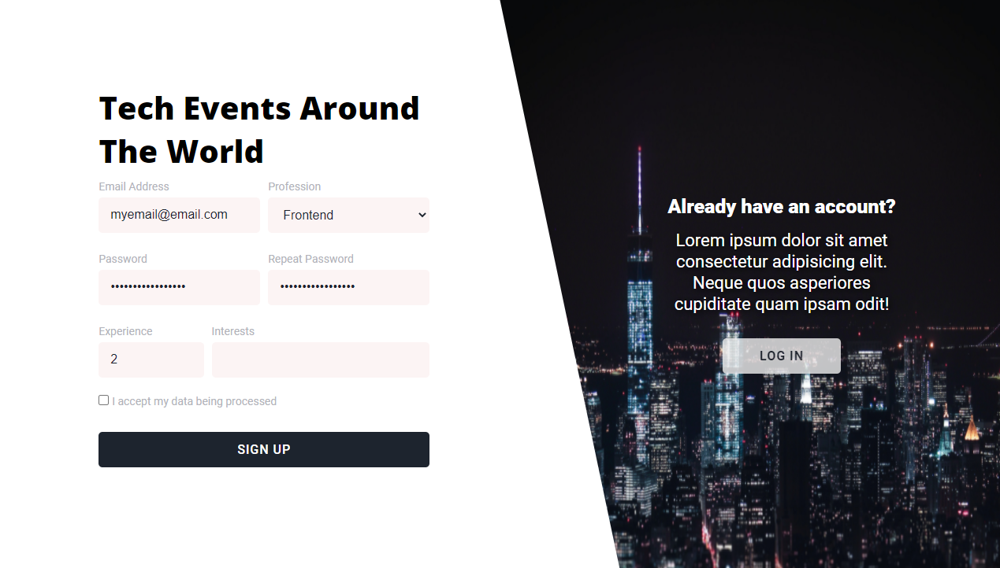
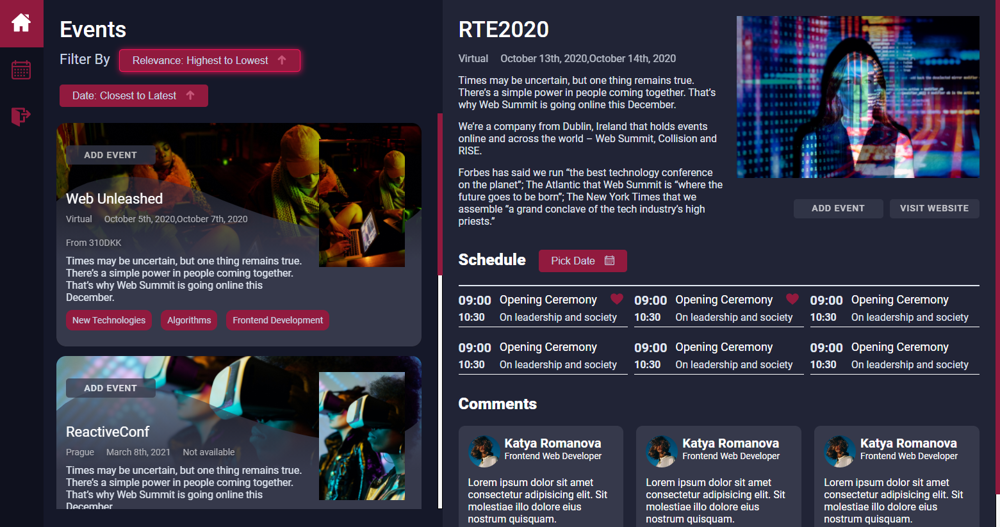
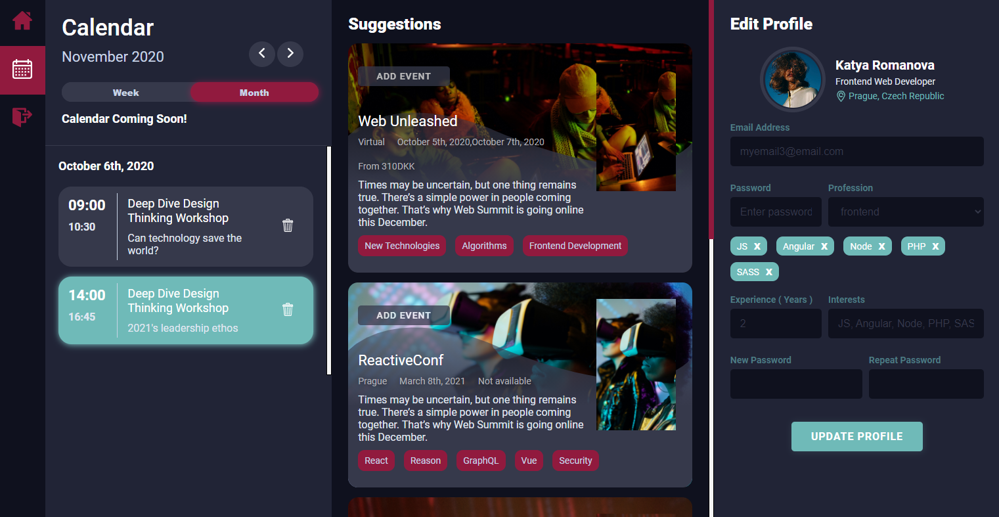

## NodeJS Technology Events App
A personal project bringing a GUI web interface with tech events for tech enthusiasts together with fetching data from the database on a Node based backend.

### Technologies
- Node v12.18.3
- MySQL Workbench
- SASS

### Features
- Node-based Authentication System
- Dashboard ( showcasing events and filtering )
- Profile ( edit profile and personalized events list )

### Presentation of the features
- Authentication View

- Dashboard View

- Profile View

